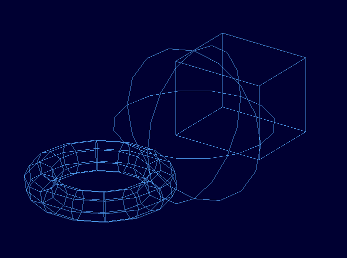

# BRL-CAD Python Bindings — GSoC 2026

  

  <b>Google Summer of Code 2026 · Organization: BRL-CAD</b> 
  Contributor: <b>Abdullah Waleed Ahmed</b> 
  Mentor: <b>Daniel Rossberg</b>

---

This repository hosts the progress logs and final submission report for the Google Summer of Code 2026 project **BRL-CAD Python Bindings**, built on the [MOOSE](https://github.com/BRL-CAD/MOOSE) C/C++ interface layer.

> **Overview**  
> The goal of this project is to give BRL-CAD a reliable, pythonic modeling path without redesigning the core engine. Work spans a stable C ABI on top of MOOSE, typed Python wrappers via `ctypes`, and broad primitive / CSG coverage so users can create, inspect, and combine geometry from Python and verify results in MGED.

### Status at a glance

| | |
|---|---|
| **Completed** | Mapped the MOOSE C bridge into Python (databases, primitives, combinations, VectorList, and related helpers) with `ctypes` bindings and OO wrappers — twelve PRs merged to MOOSE. |
| **Remaining** | Production readiness: packaging/`libbrlcad` discovery, end-to-end create→add→save→load, docs/tutorials, CI smoke tests, and PyPI / install-tree distribution aligned with MOOSE. |

Full detail: [Work completed and remaining](final-report.md#work-completed-and-remaining) in the final report.

---

## Key links

| Resource | Link |
|----------|------|
| Upstream MOOSE | https://github.com/BRL-CAD/MOOSE |
| Development repository | https://github.com/AWaleed-Ahmed/brlcad-python-bindings |
| Contributor GitHub | https://github.com/AWaleed-Ahmed |
| Proposal | [Python-Binding.pdf](Python-Binding.pdf) |
| Organization | https://brlcad.org/ |

---

## Project schedule (UTC+05:00), 2026

| Date range | Focus |
|------------|--------|
| May 1 – May 18 | Community bonding, proposal alignment, MOOSE / C-bridge study |
| May 19 – May 30 | First merged C-API foundations (casts, Arb8, SetName / SetTitle) |
| June 1 – June 30 | Core primitives, Object completion, Combinations (CSG) |
| July 1 – July 31 | BoT, first Python package merge, torus family & more primitives |
| August 1 – August 10 | Remaining primitives, polish, demo geometry & final report |

---

## Reports

| Document | Description |
|----------|-------------|
| [**Final Report**](final-report.md) | Formal project summary, architecture, deliverables, and all pull requests |
| [May 2026 daily log](reports-may-2026.md) | Weekday work log |
| [June 2026 daily log](reports-june-2026.md) | Weekday work log |
| [July 2026 daily log](reports-july-2026.md) | Weekday work log |
| [August 2026 daily log](reports-august-2026.md) | Weekday work log |
| [Architecture (Mermaid)](architecture-mermaid.md) | Diagram sources for export |
| [Demo script](scripts/create_and_view_demo.py) | Create a `.g` scene and open MGED |

---

## Pull requests (all merged)

All contributions were submitted to **[BRL-CAD/MOOSE](https://github.com/BRL-CAD/MOOSE)**:

| PR | Title | Merged |
|----|--------|--------|
| [#7](https://github.com/BRL-CAD/MOOSE/pull/7) | Expand `CastConstDatabase` for FileDatabase & MemoryDatabase | 2026-05-21 |
| [#8](https://github.com/BRL-CAD/MOOSE/pull/8) | Added Arb8 C API wrapper | 2026-05-27 |
| [#9](https://github.com/BRL-CAD/MOOSE/pull/9) | Added `SetName` and `SetTitle` methods | 2026-05-30 |
| [#10](https://github.com/BRL-CAD/MOOSE/pull/10) | New C `constDatabase` methods | 2026-06-04 |
| [#11](https://github.com/BRL-CAD/MOOSE/pull/11) | Sphere, Ellipsoid, and Cone | 2026-06-11 |
| [#12](https://github.com/BRL-CAD/MOOSE/pull/12) | Completion of Arb8 and Object | 2026-06-21 |
| [#13](https://github.com/BRL-CAD/MOOSE/pull/13) | Combination | 2026-06-28 |
| [#14](https://github.com/BRL-CAD/MOOSE/pull/14) | BoT C++ / C interface | 2026-07-18 |
| [#15](https://github.com/BRL-CAD/MOOSE/pull/15) | Python Bindings | 2026-07-22 |
| [#16](https://github.com/BRL-CAD/MOOSE/pull/16) | Torus, EllipticalTorus, HyperbolicCylinder | 2026-07-26 |
| [#17](https://github.com/BRL-CAD/MOOSE/pull/17) | Particle, Paraboloid, Hyperboloid, Halfspace | 2026-08-01 |
| [#18](https://github.com/BRL-CAD/MOOSE/pull/18) | Unknown, VectorList, Sketch, ParabolicCylinder, Pipe | 2026-08-09 |
| [#19](https://github.com/BRL-CAD/MOOSE/pull/19) | Python Wheel & VectorList/Sketch fixes | Unmerged (18 August) |

---

## Demo geometry

Wireframe view of the GSoC demo scene (`sphere` + `rpp`/`arb8` + `torus`) opened in MGED:

  

---

  <em>Bringing decades of solid modeling power to Python.</em>

