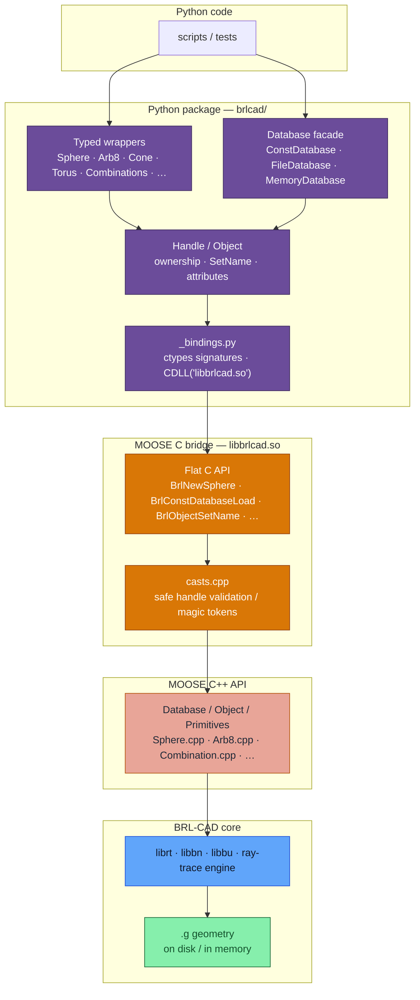
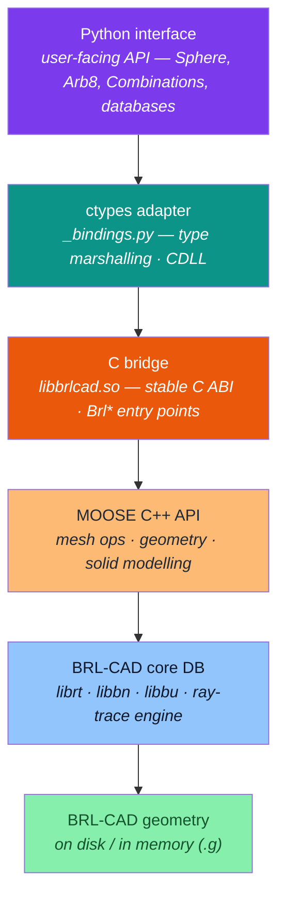
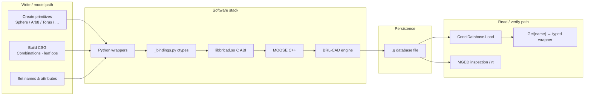

# Architecture diagrams for GSoC 2026 — BRL-CAD Python Bindings

## 1) Implemented stack 

This is the architecture **as shipped** in
[BRL-CAD/MOOSE](https://github.com/BRL-CAD/MOOSE) and
[AWaleed-Ahmed/brlcad-python-bindings](https://github.com/AWaleed-Ahmed/brlcad-python-bindings).

## 2) Proposal-style vertical abstraction layers

Aligned with your proposal diagram (Python → adapter → C bridge → MOOSE → BRL-CAD → .g).

## 3) Read / write data flow (user workflow)

